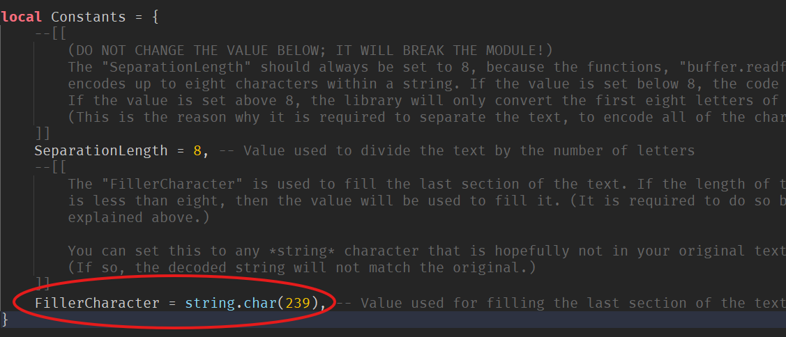

# String Obfuscator

This module is a simple string obfuscation utility which uses the
[buffer](https://luau.org/library#buffer-library) library, along with 64-bit floating-point value conversions.

This module allows you to encode any string text into 64-bit float values, and decode them the other way around.

To get the **latest** version, you must insert the [Roblox Model](https://create.roblox.com/store/asset/88982989410933) into your Roblox experience.

## Documentation

Here is the documentation of the module:

### F64Encode

Function:
```
F64Obfuscator:F64Encode(value:string):F64EncodedTable
```

Example:
```lua
local message = "Hello world!"
local encoded = F64Obfuscator:F64Encode(message) -- The function will return a table of 64-bit float values (F64EncodedTable type), each of which encodes 8 characters that were divided within the original text
```

### F64Decode

Function:
```
F64Obfuscator:F64Decode(value:F64EncodedTable):string
```

Example:
```lua
local message = "Hello world!"
local encoded = F64Obfuscator:F64Encode(message) -- encoded table type is known as "F64EncodedTable"

local result = F64Obfuscator:F64Decode(encoded)
print(result) -- The result would be the exact same as the original message above.

print(result == message) -- This would print out "true"
```

### Changing the filler character constant
Whenever the last divided section of the original message contains less than eight characters, there will be **filler characters** that would fill up the last section until the text length is `8`.

You can change the value *inside the module* through the `Constants` table and changing the `FillerCharacter` value.



**(The character should be very specific; strings that gets encoded should NOT include this character.)**

Default:
```
FillerCharacter = string.char(239)
```
